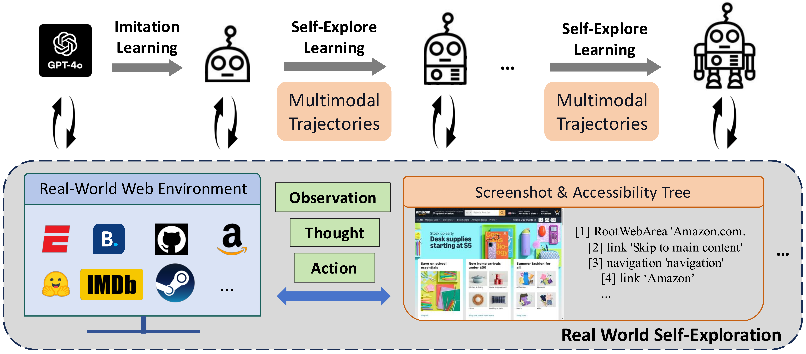

<div align="center">
<h1> OpenWebVoyager: Building Multimodal Web Agents via Iterative Real-World Exploration, Feedback and Optimization </h1>
</div>

<div align="center">


</div>

<div align="center">

</div>

## Introduction

This repository contains the data, implementation, and models for our paper [OpenWebVoyager](). OpenWebVoyager is an innovative framework for building multimodal web agents through iterative real-world exploration, feedback, and optimization. 

- **Multimodal and Real-World**: We utilize the [WebVoyager](https://arxiv.org/abs/2401.13919) framework to collect multimodal trajectories.
- **Imitation Learning**: OpenWebVoyager acquires basic web navigation skills via Imitation Learning (IL) from GPT-4o.
- **Iterative Exploration-Feedback-Optimization**: OpenWebVoyager conducts real-world exploration to gather new multimodal trajectories, with GPT-4o providing automatic feedback. Successful trajectories are retained for further optimization.

The real-world web navigation framework is based on [WebVoyager](https://github.com/MinorJerry/WebVoyager), our training code is based on [Pai-Megatron-Patch](https://github.com/alibaba/Pai-Megatron-Patch) and [Megatron-LM](https://github.com/NVIDIA/Megatron-LM), and we would like to thank their contributors for the effort.

### Full Process

- Synthesize task queries for Imitation Learning and Exploration-Feedback-Optimization cycles.
- Collect IL trajectories, convert them to training format, and perform training (Imitation Learning).
- Iteration 1: Exploration with GPT-4o's feedback. Collect successful trajectories for optimization iteration 1; continue training.
- Iteration 2: Exploration with GPT-4o's feedback. Collect successful trajectories for optimization iteration 2; continue training.
- Iteration 3: Exploration with GPT-4o's feedback. Collect successful trajectories for optimization iteration 3; continue training.
- ...

## Dependencies

The dependencies are specified in detail in `requirements.txt`. To set up the environment for hosting agents on **A100 GPU** and performing web navigation, please use the following commands:
  ```bash
  conda create -n openwebv python=3.10.14
  conda activate openwebv
  pip install torch==2.1.2 torchvision==0.16.2 torchaudio==2.1.2 --index-url https://download.pytorch.org/whl/cu118
  pip install -r requirements.txt
  ```

**Hint**: 1) You can use an OS with an A100 GPU to host the agent and perform evaluation. 2) You can also host an agent on an A100 server, then build web environment on another OS. In that OS, there is no requirement for a GPU or Torch installation; just run WebVoyager and send requests to the server.

**Full Requirements**: If you wish to proceed with training, you will need to install additional dependencies to support Megatron's training. We provide a comprehensive list of requirements in `training/megatron_requirements.txt` that you can refer to for setting up the environment.

If you only need to collect GPT-4o-based trajectories, please directly refer to [WebVoyager](https://github.com/MinorJerry/WebVoyager) framework.

## Summary of Released Models
| Stage    | HF ckpt      |  
| -------- | ------------ | 
| IL       | [OpenWebVoyager-IL](https://huggingface.co/OpenWebVoyager/OpenWebVoyager-IL)      |  
| Optim-1  | [OpenWebVoyager-opt-1](https://huggingface.co/OpenWebVoyager/OpenWebVoyager-opt-1)   | 
| Optim-2  | [OpenWebVoyager-opt-2](https://huggingface.co/OpenWebVoyager/OpenWebVoyager-opt-2)   | 
| Optim-3  | [OpenWebVoyager-opt-3](https://huggingface.co/OpenWebVoyager/OpenWebVoyager-opt-3)   | 


## Quick Start

We recommend to Host Agent to perform exploration or evaluation.

### Host Server and Run Tasks

Place the HF checkpoint at a specified path. Refer to `server/hf_online_server.py` to host the agent:
```bash
cd server/
python hf_online_server.py --model_name_or_path your_hf_checkpoint --port 8080
```

Use the `WebVoyager/run_localhost.sh` script to collect test trajectories. Please specify your host ip.
```
nohup python -u run.py \
    --test_file ./data_for_test/example.jsonl \
    --headless \
    --max_iter 15 \
    --max_attached_imgs 3 \
    --save_accessibility_tree \
    --output_dir ./results_example_test \
    --api_localhost http://xxx.xxx.xxx.xxx:8080/predict > results_example_test.log &
```

**Hint**: To increase efficiency, you can also host multiple agents on different GPUs using separate ports. On your computer, you can run 2-3 test programs (2-3 browsers are ok).

### Run GPT-4o Based Auto Evaluation

After collecting trajectories, utilize GPT-4o for Auto Evaluation to calculate the Task Success Rate. Refer to `WebVoyager/evaluation/run_eval.sh` for auto evaluation.


## Data Collection

### Task Queries

Task queries used in our experiments are listed in `WebVoyager/data_for_training` and `WebVoyager/data_for_test`. Queries labeled 'human-extend' are manually collected for lower difficulty, while those labeled "extend" are synthesized by GPT-4o. During the Imitation Learning (IL) phase, there are 1516 task queries. In Optimization iterations 1, 2, and 3, there are 480 queries each (10 per website). **Remember to check the date and event of time-sensitive tasks before collecting trajectories.**

### Imitation Learning Trajectories

Imitation Learning Trajectories are collected by WebVoyager-4o (WebVoyager with GPT-4o). Refer to `WebVoyager/run_webvoyager_4o.sh` to collect trajectories via GPT-4o.

### Exploration-Feedback-Optimization Cycles

In each iteration, the agent explores websites based on given task queries. After sampling a trajectory for a specific task, GPT-4o evaluates it immediately. If successful, the agent moves to the next task; otherwise, it resamples the trajectory, with a maximum of 5 attempts.

This process requires both a hosted agent and GPT-4o for auto evaluation, which can be complex. Separate code and scripts are provided. Refer to `WebVoyager/exploration_feedback.sh`.

## Training

### Convert Data to Training Format

The training data follows the format below:
```bash
[
  {
    "id": "...",  # str, a unique identifier for the data item.
    "images": ["..."],  # list[str], screenshots used in the data item (up to 3), represented by their filenames.
    "conversations": [  # list[dict], a sequence of conversations where the number of "<image>" tokens matches the length of the "images" list.
      {
        "from": "human",
        "value": "..."
      },
      {
        "from": "gpt",
        "value": "Thought: ...\n\nAction: ..."
      },
      ...
    ]
  },
]
```

A simple example is available in `training/example_dataset_path/stage1_Imitation_Learning`.

To prepare the data:
1. Convert the trajectories to a JSON file, then rename and copy the screenshots to an image folder. The reference code for conversion is provided in `convert_trajectories_to_json.py` (Variables to modify: `result_dir`, `image_dir`, `save_json_file`, `round_id`).
2. Compress the JSON file and images into a `.tar` file using the webdataset format. Refer to `convert_to_tar_data.py` for guidance.

The converted `.tar` data files have been released.

### The Pretrained idefics2-8b-instruct

We use the pretrained checkpoint provided by the repository [idefics2-8b](https://huggingface.co/HuggingFaceM4/idefics2-8b).

For training on 8 A100 GPUs, convert the Hugging Face checkpoint to Megatron format using the script `Pai-Megatron-Patch/toolkits/model_checkpoints_convertor/idefics2/hf2mg_8A100.sh`. The converted checkpoint will also be made available.


### Train Agent

Our training process consists of four stages: Imitation Learning, Optimization Iteration 1, Iteration 2, and Iteration 3. The training method remains the same across all stages, with differences in the starting checkpoint and the datasets used.

1. Save the processed data and the starting checkpoint to a custom directory (refer to `example_dataset_path` and `example_pretrain_checkpoint_path`).
2. Use the script located at `training/Pai-Megatron-Patch/example/idefics2/train_OpenWebVoyager_idefics2.sh`. Update the following paths in the script:
   ```
   MEGATRON_PATCH_PATH = ...  # Path to the 'Pai-Megatron-Patch' folder
   DATASET_PATH = ...  # Path to the processed data (folder containing '.tar' files)
   PRETRAIN_CHECKPOINT_PATH = ...  # Path to the Megatron checkpoint to be fine-tuned (see example path)
   OUTPUT_BASEPATH = ...  # Path for saving the output checkpoint and logs
   ```
   It is recommended to use SEQ_LEN=8192 to cover most accessibility trees.
3. Run the script:
   ```bash
   cd Pai-Megatron-Patch/example/idefics2
   bash train_OpenWebVoyager_idefics2.sh
   ```
4. We release the checkpoints for each stage.


### Convert Trained Model to HF Checkpoint

When using this repository to train your agent, convert the Megatron model to a Hugging Face (HF) checkpoint for inference. Please refer to `training/Pai-Megatron-Patch/toolkits/model_checkpoints_convertor/idefics2/mg2hf_idefics2.sh` .


## Citation

If you find our work helpful, please consider citing our paper:
```

```


## Disclaimer

This project is intended for research purposes only. Human supervision is required when the agent accesses web pages to avoid any adverse effects. The project assumes no legal responsibility for model outputs, web pages viewed, or data obtained.

Please be aware that the IL stage may result in significant API token consumption. Subsequent exploration-feedback stages will also incur some API costs. Additionally, the agent's performance and efficiency may be influenced by the operating system and the host's location, as web page formats differ by region. 

